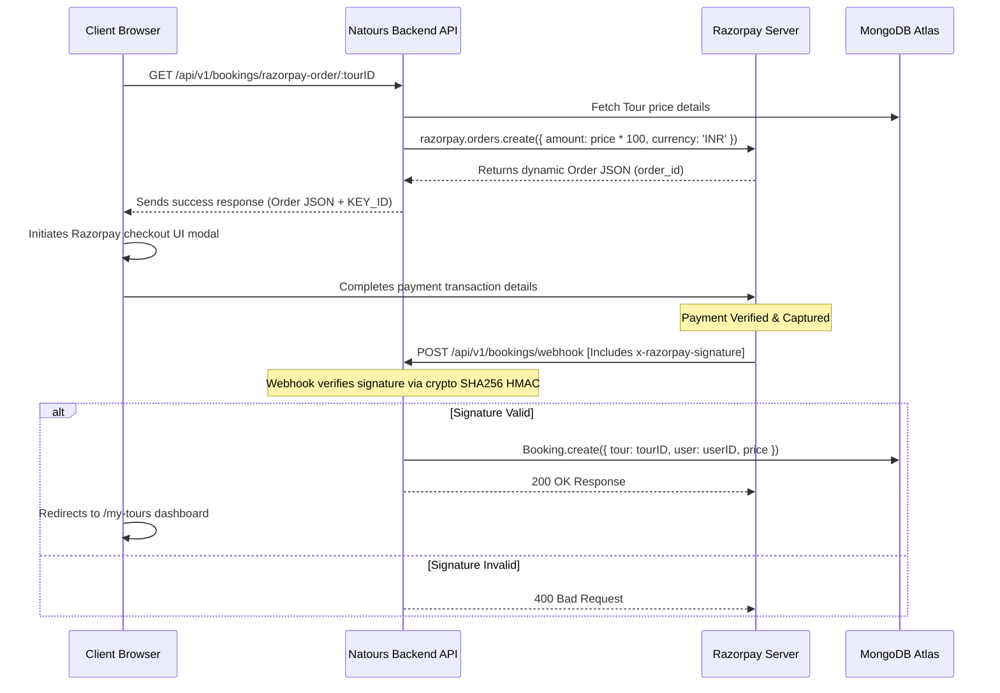

# 🏔️ Natours — Tour Booking API & Server-Side Web Application

Natours is a robust, feature-rich, high-performance tour booking application. The project features a hybrid architecture: it is equipped with a server-side rendered (SSR) frontend using **Pug templates**, while simultaneously functioning as a decoupled, industry-grade RESTful API that fully supports a dynamic client application (such as React + Vite running on `http://localhost:5173`) with Cross-Origin Resource Sharing (CORS) credentials and JWT-in-cookie sessions.

Built with a complete **Model-View-Controller (MVC)** pattern using **Node.js, Express, and MongoDB/Mongoose**, Natours integrates modern backend practices, dynamic file processing, automated mailing, secure online payments via **Razorpay**, geospatial calculations, and top-tier security standards.

---

## 🚀 Architectural Highlights & Core Features

### 🔐 1. Advanced Authentication, Authorization & Session Management
*   **Secure Password Hashing:** Uses `bcryptjs` (cost factor of 12) for industry-standard encryption.
*   **JWT Token in HTTP-Only Cookies:** Custom authentication with JSON Web Tokens. Cookies are configured as `httpOnly` to mitigate Cross-Site Scripting (XSS) token-stealing attacks, and set to `secure` in production.
*   **Dual Authentication Support:** Supports both HTTP `Authorization: Bearer <token>` headers (for API clients/mobile apps) and secure cookie detection (for web and SSR views).
*   **Role-Based Access Control (RBAC):** Restricts administrative endpoints dynamically to specific user groups: `['user', 'guide', 'lead-guide', 'admin']`.
*   **Secure Workflows:** Features full password reset mechanism (emails containing cryptographic tokens valid for only 10 minutes) and active password update features.
*   **State-Preserving Checks:** Prevents deprecated tokens from accessing routes if a user deletes their account or updates their password after the token was issued.

### 🛡️ 2. Comprehensive Security & API Sanitation Middleware
*   **NoSQL Query Injection Prevention (`express-mongo-sanitize`):** Automatically strips query selectors (like `$` or `.`) from inputs to prevent database injection exploits.
*   **Cross-Site Scripting Protection (`xss-clean`):** Sanitizes user inputs to neutralize malicious HTML and scripts.
*   **HTTP Rate Limiting (`express-rate-limit`):** Limits incoming API requests to 100 per hour per IP to guard against Denial of Service (DoS) and brute-force attempts.
*   **Security Headers (`helmet`):** Injects essential HTTP headers with a strict, customized **Content Security Policy (CSP)** that supports Leaflet map tiles, Google Fonts, and Razorpay API frames.
*   **Parameter Pollution Protection (`hpp`):** Defends query parameters against malicious duplication and whitelists valid parameters (e.g., `duration`, `price`, `ratingsQuantity`, `ratingsAverage`, `maxGroupSize`, `difficulty`).
*   **Strict CORS Configuration:** Configured to securely accept credential-sharing requests only from dedicated client servers (e.g., `http://localhost:5173`).

### 📦 3. Data Processing & Image Resizing Engine
*   **Dynamic Photo Uploads:** Configured with `multer` to handle incoming single-file profile pictures and multi-field cover/sub-tour image sets directly into memory buffers.
*   **Sharp Image Processing (`sharp`):** Compresses, reformats, and resizes uploaded photos on-the-fly to ensure light, uniform assets:
    *   **User Photos:** Resized to a clean `500x500` pixel square.
    *   **Tour Images:** Formatted to standard wide `2000x1333` landscape cover and slides, processed to high-quality progressive JPEG.

### 🗺️ 4. Advanced Geospatial Queries & Aggregation Pipelines
*   **Geospatial Indexing:** Utilizes Mongoose `2dsphere` indexes on tour starting points (`startLocation`).
*   **Tours Within Radius:** Find tours within a dynamic boundary circle using GPS coordinates (longitude/latitude) and radius parameters (miles or kilometers) via MongoDB `$geoWithin` and `$centerSphere`.
*   **Distance Calculations:** Calculates distance from any target geographical coordinate to all tours using MongoDB `$geoNear` aggregation pipeline, converting values dynamically depending on requested metric units (`mi` or `km`).
*   **Analytics Aggregation Engines:** 
    *   **Tour Statistics:** Calculates average rating, minimum/maximum/average prices, and total reviews grouped by difficulty using MongoDB aggregates.
    *   **Monthly Tour Planners:** Aggregates tour occurrences over a given calendar year using `$unwind` and grouping by starting months.

### 💳 5. Secured Booking & Transaction Management via Razorpay
*   **Order Creation:** Creates structured order requests with a custom Razorpay client instanced directly on the backend via the tour price conversion to paise (INR).
*   **Signature-Verified Webhooks:** Features a public, un-authenticated webhook endpoint `/api/v1/bookings/webhook` verifying signed payloads coming directly from Razorpay. On successful execution (`payment.captured` or `order.paid`), it automatically generates a secure booking document in the database mapping the booked tour, user, and final paid price.

### 📬 6. Dynamic Mailing Service
*   **Nodemailer Integration:** Fully functional dynamic email sender using compiled Pug templates.
*   **Dual Mail Transport:**
    *   **Development:** Routes emails seamlessly through **Mailtrap** for testing templates safely.
    *   **Production:** Dynamically shifts to high-deliverability production environments using **SendGrid** configurations.
*   **Dynamic Pug Templating:** Injects user properties and dynamic URLs directly into beautiful HTML emails (e.g., User Welcome and Password Reset forms) and parses HTML into plain text fallbacks.

### ⚙️ 7. Smart Architecture and Error Handlers
*   **Unified Global Error Handler:** Distinguishes between development and production environments. In development, provides complete stacks and error details. In production, securely hides database internal details, exposing clean, friendly operational errors.
*   **Mongoose Catch-Alls:** Ingests and sanitizes database errors including MongoDB cast errors, duplicate fields, validation errors, and invalid/expired JWT configurations.
*   **Clean CRUD Controllers (Factory Pattern):** Centralizes standard CREATE, READ, UPDATE, and DELETE tasks into single factory handler functions (`handlerFactory.js`) to limit code duplication and accelerate development.

---

## 💻 Tech Stack

| Category | Technology |
| :--- | :--- |
| **Runtime Environment** | Node.js (v18+) |
| **Backend Framework** | Express.js (v5) |
| **Database** | MongoDB & Mongoose ORM |
| **View Engine (SSR)** | Pug Templating Engine |
| **Authentication & Encryption** | JWT (`jsonwebtoken`), `bcryptjs`, `crypto` |
| **Security & Protection** | Helmet, express-rate-limit, express-mongo-sanitize, xss-clean, hpp |
| **File Handling & Processing** | Multer (Buffer Uploads), Sharp (Image manipulation) |
| **Payment Gateway** | Razorpay SDK |
| **Mailing** | Nodemailer, Mailtrap, SendGrid |
| **Bundling (Pug Frontend JS)** | Parcel-bundler |

---

## 📂 Project Structure

```text
Natours/
├── Controller/              # Route controllers & Factory CRUD Handlers
│   ├── authController.js    # Sign-up, login, JWT issuance, password workflows & protections
│   ├── bookingController.js # Checkout sessions & admin CRUD bookings
│   ├── errorController.js   # Global error handling middleware (Dev vs. Prod)
│   ├── handlerFactory.js    # Reusable factory CRUD controller generators
│   ├── razorpayController.js# Razorpay webhook listener & signature verification
│   ├── reviewController.js  # Review addition, updates, and deletion filters
│   ├── tourController.js    # Tour CRUD, image processors, filters, stats, geospatial queries
│   ├── userController.js    # User accounts, custom updates, soft deletion, and profile photos
│   └── viewController.js    # Pug template rendering controller for web pages
├── dev-data/                # Sample DB Seeding Data & Admin scripts
│   ├── data/                # Sample tours.json, users.json, and reviews.json datasets
│   └── import-dev-data.js   # CLI Utility to populate/clear development database collections
├── models/                  # Mongoose Schemas & Database Models
│   ├── bookingModel.js      # Booking Schema (references Tour & User)
│   ├── reviewModel.js       # Review Schema with rating aggregations
│   ├── tourModel.js         # Tour Schema with geospatial indices & query middleware
│   └── userModel.js         # User Schema with password encryption & helper methods
├── public/                  # Static assets served directly to the browser
│   ├── css/                 # Core styles for server-rendered web pages
│   ├── img/                 # Dynamic system directories (tours/, users/, etc.)
│   └── js/                  # Client-side JavaScript logic compiled into bundle.js
├── Routes/                  # Separate routers mapping endpoints to controllers
│   ├── bookingRoutes.js     # Booking endpoints & Razorpay webhooks
│   ├── reviewRoutes.js      # Review endpoints (supports nested routing)
│   ├── tourRoutes.js        # Tour CRUD, statistics, and geospatial routes
│   ├── userRoutes.js        # Authentication & User Account profiles
│   └── viewRoutes.js        # Pug Web template routes for SSR
├── utils/                   # Shared Helper Utilities
│   ├── ApiFeatures.js       # Advanced Filtering, Sorting, Limiting, and Pagination helper
│   ├── AppError.js          # Custom Operational Error constructor class
│   ├── catchAsync.js        # Wraps async routes to automatically catch & delegate errors
│   └── email.js             # Nodemailer helper class utilizing Pug HTML emails
├── views/                   # Server-rendered Pug view templates
│   ├── emails/              # Dynamic welcome & password-reset Pug email templates
│   ├── base.pug             # Base layout template containing header & footer blocks
│   └── *.pug                # Distinct templates (overview, tour detail, dashboards, etc.)
├── app.js                   # Express application setup, security stack, CORS, routing mounts
├── server.js                # System Entrypoint: database connection and HTTP listener
├── config.env.example       # Example Environment Template file
└── package.json             # App metadata, dependencies, and npm scripts
```

---

## 🛠️ Installation & Setup

Follow these steps to configure your environment and run the Natours server locally.

### 1. Clone the repository
```bash
git clone <repository_url>
cd Natours
```

### 2. Install dependencies
```bash
npm install
```

### 3. Setup your Environment Variables
Create a `config.env` file in the root of the project. Fill in the credentials using the reference model below (or copy from `config.env.example`):

```env
# Server Configurations
NODE_ENV=development
PORT=3000

# MONGODB CONNECTION
# Replace <PASSWORD> and <DB_USERNAME> with your MongoDB Atlas or Local configurations
DATABASE=mongodb+srv://<DB_USERNAME>:<DB_PASSWORD>@cluster0.xxxxx.mongodb.net/Natours?appName=Cluster0
DATABASE_LOCAL=mongodb://localhost:27017/natours

# JSON Web Tokens (JWT) Secrets
JWT_SECRET=your-super-long-secure-and-secret-jwt-key
JWT_EXPIRES_IN=90d
JWT_COOKIE_EXPIRES_IN=90

# Nodemailer - Development (Mailtrap)
EMAIL_HOST=sandbox.smtp.mailtrap.io
EMAIL_PORT=2525
EMAIL_USERNAME=your_mailtrap_username
EMAIL_PASSWORD=your_mailtrap_password
EMAIL_FROM=admin@natours.io

# SendGrid - Production
SENDGRID_USERNAME=apikey
SENDGRID_PASSWORD=your_sendgrid_api_key

# Razorpay Keys
RAZORPAY_KEY_ID=rzp_test_your_key_id
RAZORPAY_KEY_SECRET=your_key_secret
RAZORPAY_WEBHOOK_SECRET=your_webhook_secret_key
```

### 4. Bundle Frontend Assets (Pug Web Application)
If you plan to use the server-rendered Pug views, compile the client-side JavaScript bundle using Parcel:
```bash
# Watch files for changes
npm run watch:js

# Or build the bundle for production
npm run build:js
```

### 5. Launch the Server
```bash
# Run in development mode (launches server with Nodemon auto-reloads)
npm run dev

# Run in production mode
npm run start
```
The server will boot and display `db is connected successfully`, listening on `http://localhost:3000`.

---

## 💾 Database Seeding & Development Script

A helper script is provided in `dev-data/import-dev-data.js` to seed or purge your MongoDB database collections quickly during development.

> [!WARNING]
> Running the delete command will drop all documents inside the Users, Tours, and Reviews collections.

Ensure you have your `config.env` loaded or temporarily uncomment line 11 in `dev-data/import-dev-data.js` (`dotenv.config({ path: './config.env' });`) before running commands directly.

```bash
# Seed all sample data (Tours, Reviews, Users with disabled validations to skip hashing)
node ./dev-data/import-dev-data.js --import

# Clear all data from Database collections
node ./dev-data/import-dev-data.js --delete
```

---

## 🎟️ Razorpay Payment Integration Details

Natours utilizes a secure, mock-ready **Razorpay** checkout experience. In `bookingController.js` and `razorpayController.js`, order processing and webhook management are constructed as follows:



---

## 📬 Detailed API Documentation & Endpoints

All endpoints beneath `/api` are fully CORS-enabled. Standard requests receive and send JSON payloads.

### 🏔️ Tours Endpoint
| HTTP Method | Route Endpoint | Description | Protected | Roles Allowed | Query/Params Example |
| :--- | :--- | :--- | :---: | :--- | :--- |
| **GET** | `/api/v1/tours` | Fetch all tours | ❌ | All | Supports API filtering, sorting, field limiting & pagination |
| **GET** | `/api/v1/tours/:id` | Fetch specific tour details | ❌ | All | Dynamically populates connected review profiles |
| **POST** | `/api/v1/tours` | Create a new Tour document | 🔑 | `admin`, `lead-guide` | Requires structured Tour JSON payload |
| **PATCH** | `/api/v1/tours/:id` | Update specific Tour details | 🔑 | `admin`, `lead-guide` | Supports Multer uploading (`imageCover`, `images`) |
| **DELETE** | `/api/v1/tours/:id` | Delete Tour completely | 🔑 | `admin`, `lead-guide` | — |
| **GET** | `/api/v1/tours/top-5-cheap` | Alias route fetching cheapest tours | ❌ | All | Predetermines limit=5, sort=-ratingsAverage,price |
| **GET** | `/api/v1/tours/tour-stats` | Fetch aggregate tour metrics | ❌ | All | Grouped by difficulty (Avg price, rating counts, etc.) |
| **GET** | `/api/v1/tours/monthly-plan/:year` | Aggregate year tours schedule | 🔑 | `admin`, `lead-guide`, `guide` | e.g. `/api/v1/tours/monthly-plan/2026` |
| **GET** | `/api/v1/tours/tours-within/:distance/center/:latlng/unit/:unit` | Find tours near a coordinate | ❌ | All | e.g. `/tours-within/250/center/34.1,-118.2/unit/mi` |
| **GET** | `/api/v1/tours/distance/:latlng/unit/:unit` | Calculate distances from target | ❌ | All | e.g. `/distance/34.1,-118.2/unit/km` |

### 👤 Users & Account Management
| HTTP Method | Route Endpoint | Description | Protected | Roles Allowed | Key Fields / Headers |
| :--- | :--- | :--- | :---: | :--- | :--- |
| **POST** | `/api/v1/users/signup` | Register a new user | ❌ | All | `name`, `email`, `password`, `passwordConfirm` |
| **POST** | `/api/v1/users/login` | Login user & issue cookie / JWT | ❌ | All | `email`, `password` |
| **GET** | `/api/v1/users/logout` | Clears local JWT cookies | ❌ | All | — |
| **POST** | `/api/v1/users/forgetPassword` | Sends recovery token to mail | ❌ | All | `email` |
| **PATCH** | `/api/v1/users/resetPassword/:token` | Resets user password | ❌ | All | `password`, `passwordConfirm` |
| **PATCH** | `/api/v1/users/updatePassword` | Update active user's password | 🔑 | Logged in user | `oldPassword`, `newPassword`, `newPasswordConfirm` |
| **GET** | `/api/v1/users/me` | Fetch active user's profile | 🔑 | Logged in user | Maps internally to `/api/v1/users/:id` |
| **PATCH** | `/api/v1/users/updateMe` | Update account text parameters | 🔑 | Logged in user | Supports uploading user image under `photo` field |
| **DELETE** | `/api/v1/users/deleteMe` | Deactivates account (Soft Delete) | 🔑 | Logged in user | Sets `active: false` to hide from query builders |
| **GET** | `/api/v1/users` | Fetch all active accounts | 🔑 | `admin` | — |
| **DELETE** | `/api/v1/users/:id` | Drop user database record | 🔑 | `admin`, `lead-guide` | Hard deletion (not soft deletion) |

### 💬 Reviews & Ratings
| HTTP Method | Route Endpoint | Description | Protected | Roles Allowed | Notes |
| :--- | :--- | :--- | :---: | :--- | :--- |
| **GET** | `/api/v1/reviews` | Get all reviews in system | 🔑 | All | Supports nested reviews filter: `/tours/:tourId/reviews` |
| **POST** | `/api/v1/reviews` | Add new review rating | 🔑 | `user` | Supports nested additions: `/tours/:tourId/reviews` |
| **PATCH** | `/api/v1/reviews/:id` | Modify an existing review | 🔑 | `admin`, `user` | Triggers average rating calculations dynamically |
| **DELETE** | `/api/v1/reviews/:id` | Remove a review rating | 🔑 | `admin`, `user` | Recomputes average rating statistics upon deletion |

### 🎟️ Bookings & Orders
| HTTP Method | Route Endpoint | Description | Protected | Roles Allowed |
| :--- | :--- | :--- | :---: | :--- |
| **GET** | `/api/v1/bookings/razorpay-order/:tourID` | Create a verified Razorpay order | 🔑 | Logged in user |
| **POST** | `/api/v1/bookings/webhook` | Receives signature webhook | ❌ | Razorpay Service Webhook |
| **GET** | `/api/v1/bookings` | Fetch all bookings | 🔑 | `admin`, `lead-guide` |
| **POST** | `/api/v1/bookings` | Create custom booking | 🔑 | `admin`, `lead-guide` |

---

## 🌟 Pug Server-Side Rendered (SSR) Web Pages

Pug templates allow you to access the web application by running `npm run dev` and browsing the following pages:

*   **🌐 Overview Page (`/`)**: Discover and filter beautiful tours cards listing prices, start dates, duration, locations count, ratings, and details.
*   **🏔️ Tour Detail Page (`/tour/:slug`)**: In-depth information for individual tours containing a full Leaflet map illustrating routes locations, guides rosters, reviews sliders, and a **Book Tour Now** button triggering Razorpay checkout directly.
*   **🔑 Access Pages (`/login` & `/signup`)**: Minimal, sleek forms featuring client-side validation logic for account creation and login.
*   **👤 Account Dashboard (`/me`)**: Complete user options panel. Users can update names, email addresses, and upload profile pictures, as well as change active passwords.
*   **🎟️ My Booked Tours (`/my-tours`)**: Visual grid of all purchased tours.
*   **⭐ My Reviews (`/my-reviews`)**: Grid of ratings given by the user with easy options to manage them.
*   **👑 Admin Management Dashboards**:
    *   `/manage-tours`: Admin dashboard to view, add, and manage tours.
    *   `/manage-users`: Admin panel to manage system accounts.
    *   `/manage-reviews`: Admin review logs manager.
    *   `/manage-bookings`: Full booking ledger view.

---

## 🛡️ Production & Performance Enhancements

When deploying to staging or production systems, the application is optimized out-of-the-box:

*   **Asset Compression (`compression`):** Gzip compresses response body payloads dynamically to speed up loading times of CSS, static images, and JSON endpoints.
*   **Secure Environment Configurations:** Shifts session cookies to `secure: true` (only HTTPs transfers) and switches global error handling to suppress code stack traces.
*   **Database Query Optimization:** Employs precise compound indices on database schemas to fast-track query times, such as compound index `reviewSchema.index({ tour: 1, user: 1 }, { unique: true })` which simultaneously stops users from posting duplicate reviews.
